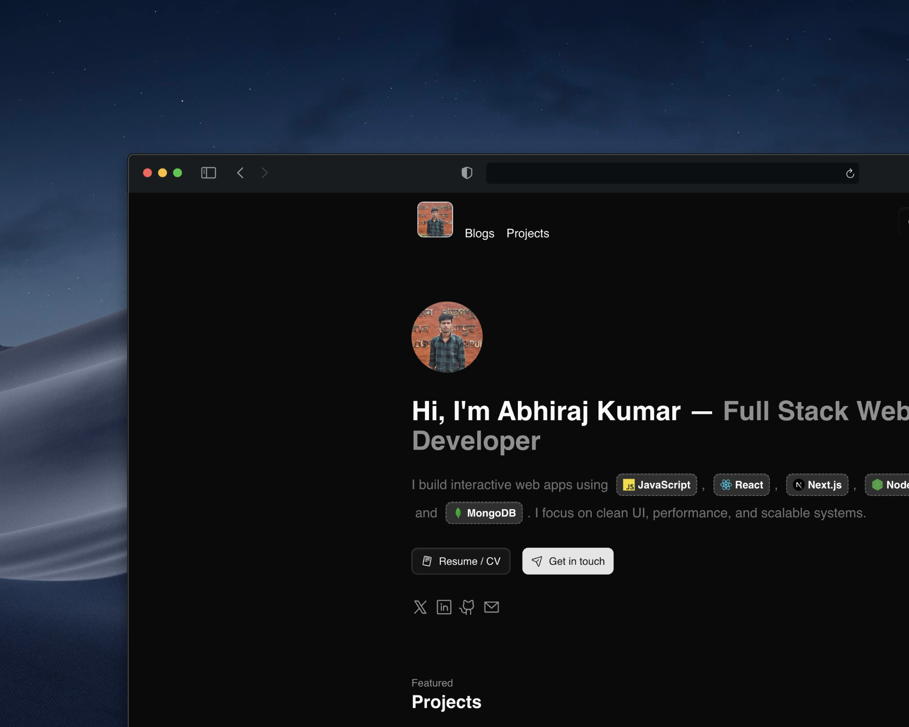

# Abhiraj

A high-performance personal portfolio built with Next.js, focused on clear storytelling, technical depth, and measurable outcomes.



## Overview

This project is designed to do three things well:

- communicate engineering capability with clarity
- present real projects with context, decisions, and outcomes
- convert interest into conversations through fast, reliable UX

The site combines polished design with production-grade implementation details across routing, rendering, content, and API integrations.

## What This Portfolio Demonstrates

- End-to-end product thinking from UI architecture to deployment
- Strong frontend execution with modern React and Next.js patterns
- Practical integrations (contact workflow, LeetCode data, MDX content)
- Engineering discipline around maintainability, type safety, and performance

## Core Features

- Responsive landing page with intentional visual hierarchy
- Project showcase with dynamic project detail routes
- Blog powered by MDX content
- Contact form and API endpoints
- Resume and about sections designed for fast recruiter and client scanning
- LeetCode API integration for live coding profile signals

## Tech Stack

- Framework: Next.js 15 (App Router)
- Language: TypeScript
- UI: React 19, Tailwind CSS, Radix UI
- Content: MDX (`next-mdx-remote`)
- Motion and Interaction: Motion, Lenis
- Forms and Validation: React Hook Form, Zod
- Charts and Data UI: Recharts

## Local Development

```bash
npm install
npm run dev
```

Open [http://localhost:3000](http://localhost:3000).

## Contact Form Email

The contact API sends email through Resend without adding a runtime package. Add these environment variables before using the form in production:

```bash
RESEND_API_KEY=your_resend_api_key
CONTACT_TO_EMAIL=you@example.com
CONTACT_FROM_EMAIL="Portfolio Contact <contact@yourdomain.com>"
```

`CONTACT_FROM_EMAIL` must use a domain verified in Resend. Do not use a personal Gmail address as the sender; keep the visitor's email in `reply_to`, which the API handles automatically.

The API returns success only after the email provider accepts the message.

## Production Build

```bash
npm run build
npm run start
```
